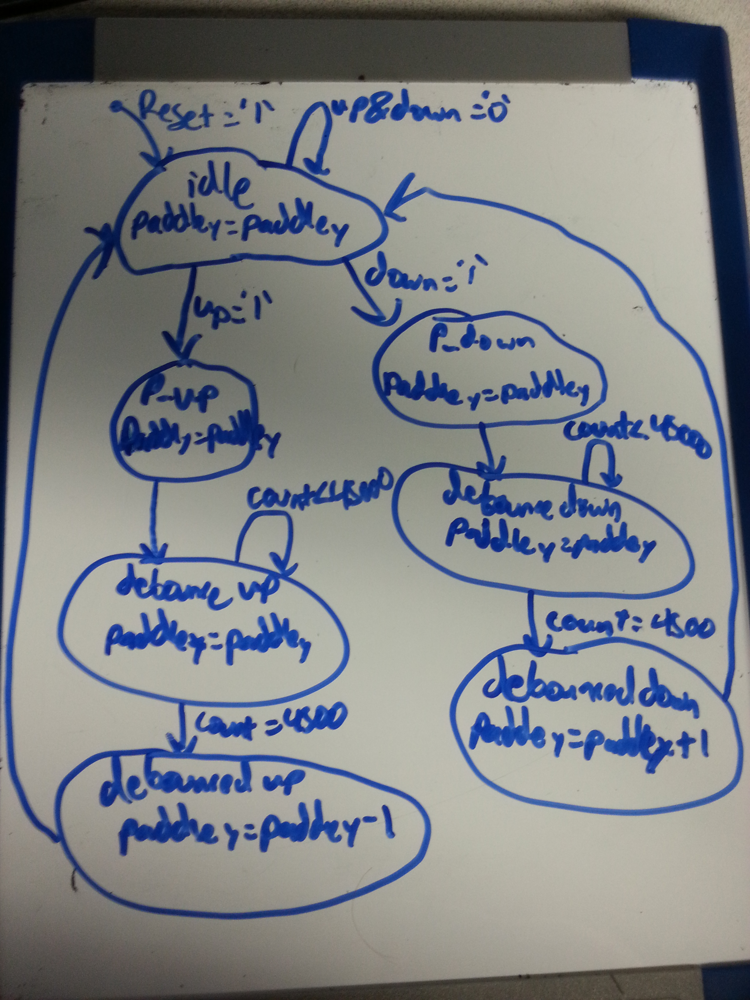

# Pong

The purpose of this lab is to create a working Pong game to be displayed on a computer monitor. We are using the previous code from the VGA Synchronization lab in order to display the game. The addtional code used was adding the buttons, a switch, and the code for the game itself.

## Implementation

This program was implemented by the creation of two different state machines in order to control the paddle and the ball. The paddle state machine delt with the motion and debouncing of the buttons. Without the debouncing portion the paddle flipped from one edge of the screen to the other. 
The following is the state machine diagram for the paddle:



The paddle state machine had two components, the state machine itself and a check to see if the ball had hit any of the walls or paddle. The following are the if and else if statements checking to see if a boundary was hit:
```
if(ball_x_reg >= screen_width-5) then
	--Hit right wall
elsif((ball_x_reg <= (paddle_space + paddle_width)) and (ball_y_reg >= paddle_y_temp and ball_y_reg <= (paddle_y_temp + paddle_height))) then
	--Check for Hot Zones (A Functionality)
	--Hit Paddle
elsif(ball_y_reg <= 5) then
	--hit top wall
elsif(ball_y_reg >= screen_height) then 
	--hit bottom wall
elsif(ball_x_reg < paddle_space) then
	--hit left wall
end if;
```

This check was used to move from state to state. The following is the state_diagram for the ball movement. Note that the "hot zones" of A functionality are not added, as well as the switch for B functionality.


B functionality wasthe addition of a switch in order to change the speed. This was just a simple addition of a switch and a simple combinational statement:

```
speed <= to_unsigned(700,11) when switch = '0' else
	 to_unsigned(400,11);
```

A functionality involved changing the ball speed in the y direction when it hits a certain area on the paddle. There are 5 sections that are split evenly on the paddle: corner top and bottom, mid top and bottom, and middle. The corners have a ball speed of 4 in that direction. The mids have a speed of 1 in that direction. The middle has a speed of 0 in the y direction.

## Test/Debug

This program was tested by trial and error. Everytime I felt that I made an effective change I tested it out by creating a new bit file and running it. This is not necessarily a time effective way of completing the testing phase, but it was the best way for me to visualize what was going on. 

I ran into two main issues: Reset/states error, and boundary errors for both the paddle and ball.

- The *reset/states error* was my biggest issue by far! The problem was that there cannot be a asynchronous set and reset happening at the same time. I had an immense amount of trouble figuring out this issue. With the help of Capt Branchflower, we discovered that the issue was that when you declare the state type you have to make your reset state the first on the list. This means that the synthesizer sets the first state described as the reset state, so if you try to make another state the reset state it gives you an error.

- The *boundary issues* were resolved by adding or subtracting 5 from the boundary in order to catch the paddle or ball before it hit the boundaries. Before this error was fixed for the ball: there was bouncing on the top wall and it seemed to be no boundary for the bottom of the screen. For the paddle: it went to the top of the screen fine, but it moved about 10 lines to many on the bottom of the screen.

## Conclusion

This lab was a lot easier than the first lab, due to not having to worry about the immense time requirements. We used the same VGA synchronous from lab 1, which is why there was a lack of worry. From this lab I learned the importance of the order of which items are declared and the importance of working on this project over time. The first is explained in the Test/Debug section. The second was shown to me when a majority of my classmates pushed the assignment off to the last minute, which their sleep and the ability to work effectively declined immensly. A possible addition to this lab could be to add the functionality of another player on the other side of the board, this would use either the left/right buttons or the use of switches to control the other paddle.
